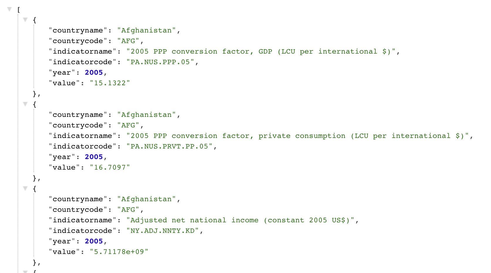
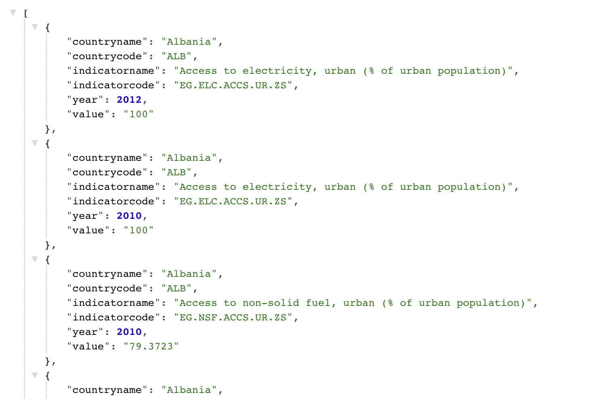
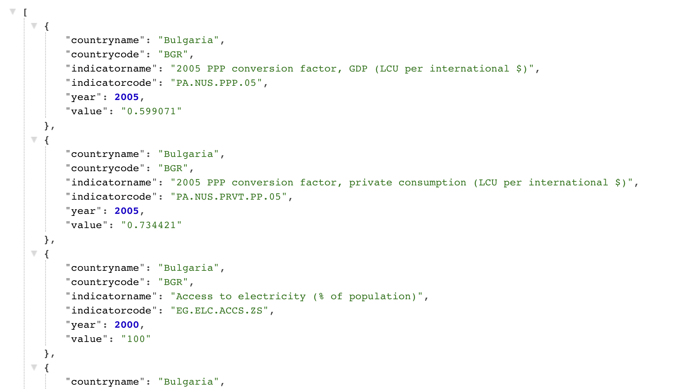
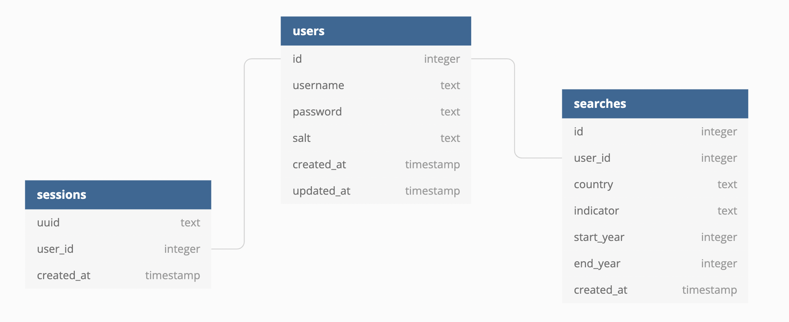

# World Bank Backend Documentation

## Contents

- [Introduction](#introduction)
- [Technologies](#technologies)
- [Launch](#launch)
- [User Authentication](#user-authentication)
  - [Creating a session ID](#creating-a-session-id)
  - [Find a current user’s ID](#find-a-current-users-id)
  - [Registering a user](#registering-a-user)
  - [Validating a user log-in](#validating-a-user-log-in)
- [Country indicators](#country-indicators)
  - [Get all indicators on a country](#get-all-indicators-on-a-country)
  - [Find certain indicators on a country](#find-certain-indicators-on-a-country)
  - [Search for indicators in a specific timeframe](#search-for-indicators-in-a-specific-timeframe)
- [User’s searches in the database](#users-searches-in-the-database)
  - [Add a user's search to the database](#add-a-users-search-to-the-database)
  - [Get a the user’s search history](#get-a-users-search-history)
- [Database Schema](#database-schema)
- [License](#license)
- [Developers](#developers)


## Introduction

This is the backend server of the World Bank app that handles http requests from the client to access the database for information.
We also have tests included.

## Technologies 

This repository uses [deno](https://deno.land/manual/getting_started/installation) to run its files.
For our database we use [PostgreSQL](https://www.postgresql.org/) to store world information and user data online using [ElephantSQL](https://www.elephantsql.com/).

## Launch

There is another repository which is closely related and can be found [here](https://github.com/tomw13/WorldBankFrontend). It is recommended that you create a folder and clone both the frontend and backend repos into the same folder. 

Start by forking this backend repository, and then cloning the repository into your local drive. Toggle into the directory, /WorldBackEnd, and run the following command into your terminal to initiate the backend server:

```
deno run --allow-net --allow-read --allow-write server.js
```
The frontend React application requires this backend server to be running to work correctly.

## User Authentication

### Creating a session ID

A session ID is created and stored in the browser’s cookies when the user registers/logs in. This keeps the user logged in as they navigate through the application. The V4 module is imported, and is used to generate a session ID, which is then inserted into the users database.

```
const sessionId = v4.generate();
  await userDatabase.queryArray({
    text: `INSERT INTO sessions (uuid, user_id, created_at) VALUES ($sessionId, $user_id, current_timestamp)`,
    args: { sessionId: sessionId, user_id: user_id },
  });
``` 
The cookies are set here and then passed to the browser. The expiration date for the cookie is set for 24 hours.

```
await server.setCookie({
    name: "sessionId",
    value: sessionId,
    expires: expiryDate,
    path: "/",
  });

  await server.setCookie({
    name: "user_id",
    value: user_id,
    expires: expiryDate,
    path: "/",
  });

  await server.setCookie({
    name: "email",
    value: userRows.email,
    expires: expiryDate,
    path: "/",
  });

```

### Find a current user’s ID

```
async function findCurrentUserId(email) {
  const checkEmail = await userDatabase.queryObject({
    text: "SELECT * FROM users WHERE email = $email",
    args: { email: email },
  });
  const [checkEmailRows] = checkEmail.rows;
  return checkEmailRows.id;
}
```

### Registering a user

A POST request from the registration page (localhost:3000/register) is made when a new user submits their credentials for the first time. This takes a username and password in the body of the request. 

A new salt is generated for each registration and placed into the password. This salted password is then hashed using the bcrypt library’s hashing function:

```
const salt = await bcrypt.genSalt(8);
const passwordEncrypted = await bcrypt.hash(password, salt);

```
Before the user is registered, a check takes place to see if a user already exists with the same username provided. If the username already exists in the database, an error is returned, preventing the user from registering with those credentials. Otherwise, the user’s credentials are stored into the database.

``` 
if (theEmail) {
    return server.json({ error: "User already exists" }, 400);
  } else {
    const query = `INSERT INTO users (email, password, salt, created_at, updated_at) 
                   VALUES ($username, $passwordEncrypted, $salt, current_timestamp, current_timestamp)`;
    await userDatabase.queryArray({
      text: query,
      args: {
        username: username,
        passwordEncrypted: passwordEncrypted,
        salt: salt,
      },
    });

```
Afterwards, a session is created for the user and they are redirected to the search page.

```
const user_id = await findCurrentUserId(username);
    await createSession(server, user_id);

```

### Validating a user log-in 

When the user hits the submit button on the log-in page, a POST request is made to server.js, where the checkUserLogin handle is triggered. The username and password are sent in the body of the request.

```
const { email, password } = await server.body;
  const checkEmail = await userDatabase.queryObject({
    text: "SELECT * FROM users WHERE email = $email",
    args: { email: email },
  });

```

A query is made to the database to check if the user exists, otherwise an error message is returned. If the user exists, a session is created for them, and they are redirected to the search page.

```
if (checkEmailRows) {
    if (await bcrypt.compare(password, checkEmailRows.password)) {
      await createSession(server, checkEmailRows.id);
      return server.json(checkEmailRows, 200);
    } else {
      server.json({ error: "Incorrect password" }, 400);
    }
  } else {
    server.json({ error: "User not found." }, 404);
  }

```

## Country indicators

You need to be logged in to be able to search for country indicators.

### Get all indicators on a country

The country endpoint is required, and will give information about all available indicators for the country entered.
```
/{country}

Ex. /Afghanistan
```



You can input indicators and timeframes as query parameters to restrict the returned information. Without any the default parameters are 

Indicator = ’’<br/>
startYear = 1960<br/>
endYear  = 2015

There’s only information from 1960 to 2015 so those are the default parameters.

### Find certain indicators on a country

After the country endpoint you can add an indicator query to find indicator information that will include that indicator.

```
/{country}?indicator={indicator}

Ex. /Albania?indicator=urban%20population
```


### Search for indicators in a specific timeframe

You can also add queries to choose a specific timeframe to get information from.

```
/{country}?startYear={startYear}&endYear={endYear}

Ex. /Argentina?startYear=1990
      /Australia?endYear=2007
      /Bulgaria?startYear=1995&endYear=2010
```



You can combine all the queries as well

```
Ex. /Botswana?indicator=tariff&startYear=2005&endYear=2012
```

## User’s searches in the database

### Add a user’s search to the database

Everytime a user searches for information, it’s stored into a table that stores the user’s id and search parameters that can be accessed and searched again.

### Get a user’s search history

The user’s id is passed in the URL of the request, which is then used to query all of their searches from the searches table.

```
const { user_id } = server.params;

  const response = await userDatabase.queryObject({
    text: "SELECT created_at, country, indicator, start_year, end_year FROM searches WHERE user_id = $user_id",
    args: { user_id },
  });

```

## Database Schema

### Users Database



## License 

The license for this project can be found [here](license.md)

## Developers

The Developers that worked on this project are:

Project Manager & Engineer: [Mariam Raashid](https://github.com/Mariam01010010)<br/>
Architect & Engineer: [Tom Waghorn](https://github.com/tomw13)<br/>
Quality Assurance & Engineer: [Fahmidul Haque](https://github.com/FahmidulHaquee)<br/>
Quality Assurance & Engineer: [Kishor Shris](https://github.com/Senre)
